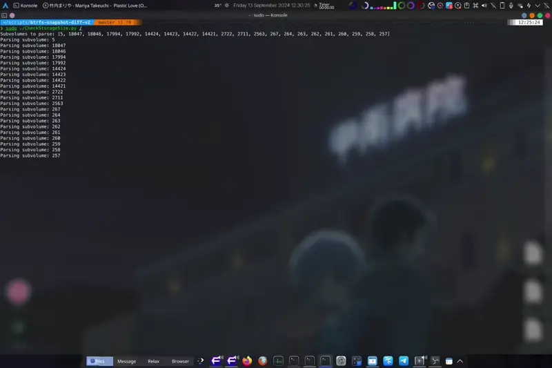
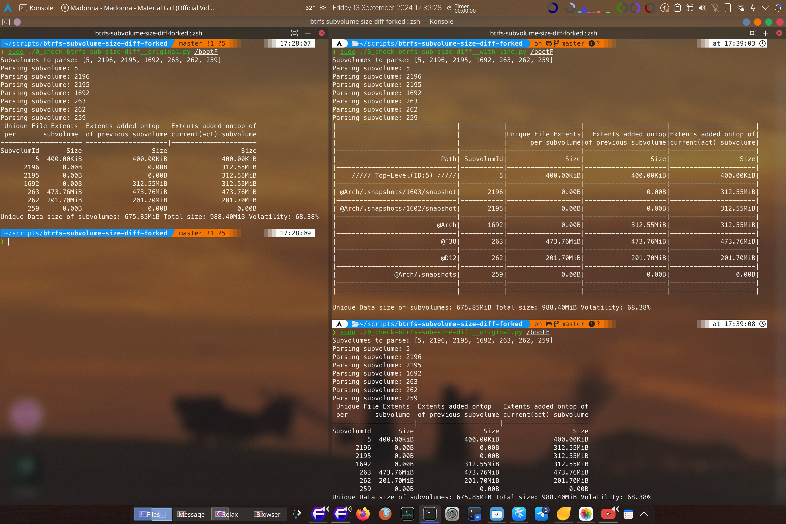
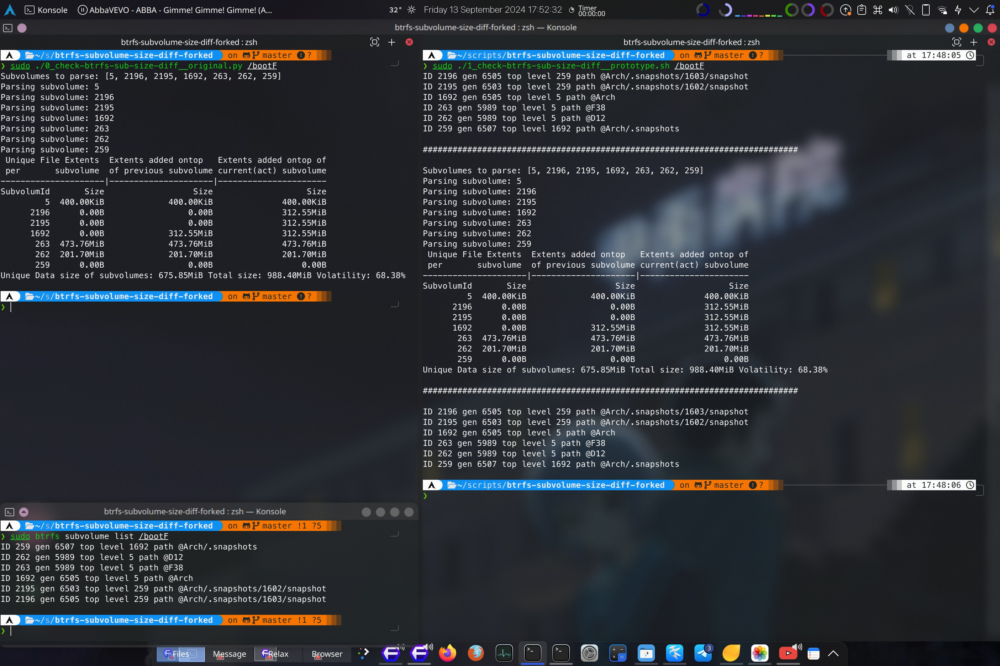
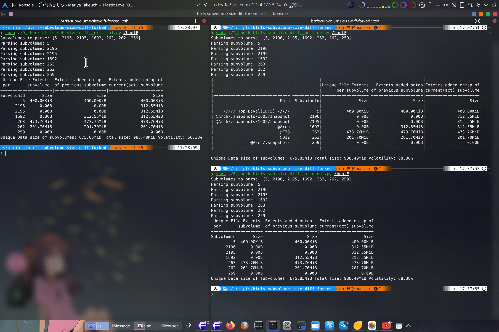
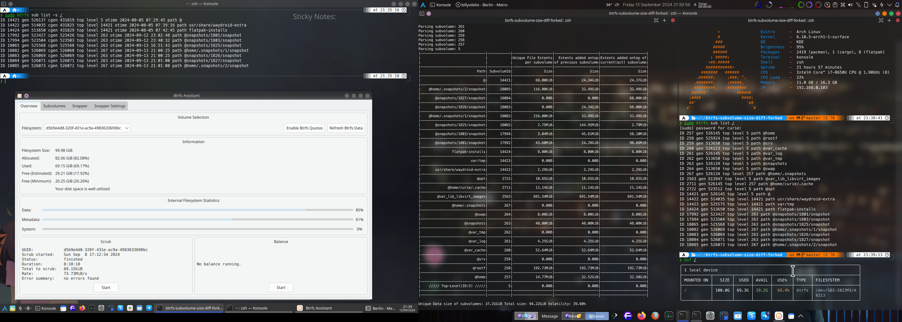

# btrfs-subvolume-size-diff-forked

This project is a fork of [`dim-geo`](https://github.com/dim-geo/)'s tool [`btrfs-snapshot-diff`](https://github.com/dim-geo/btrfs-snapshot-diff/) which find the differences between btrfs snapshots, no quota activation in btrfs needed!

The primary enhancement introduced in this fork, is the ability to display subvolume paths alongside their IDs. This makes it significantly easier to identify and manage Btrfs subvolumes, especially when dealing with complex snapshot structures.

<details>
  <summary>Video</summary>
            
https://github.com/user-attachments/assets/3c45d540-4ad1-4976-924c-41aefade0534
</details>



## Overview

- [1. Why do you need this tool?](#1-why-do-you-need-this-tool)
- [2. Original implemented functionality](#2-original-implemented-functionality)
- [3. The improvements over the original project](#3-the-improvements-over-the-original-project)
- [4. How it works](#4-how-it-works)
- [5. Installation](#5-installation)
- [6. Usage](#6-usage)\
            - [6.1 Example](#61-example)
- [7. Versions](#7-versions)
- [8. License](#8-license)
- [9. Contributing](#9-contributing)\
            - [9.1 Possible expansions](#91-possible-expansions)

## 1. Why do you need this tool?

Btrfs, as a CoW filesystem, has a problem identifying the size of a snapshot(/subvolume) and the differences between snapshots(/subvolume).

By using [python-btrfs](https://github.com/knorrie/python-btrfs), it is possible to parse the metadata of a btrfs filesystem and find the differences between subvolumes/snapshots.

## 2. Original implemented functionality:

This tool can approximately identify how much space will be freed when a snapshot(/subvolume) is deleted.

## 3. The improvements over [the original project](https://github.com/dim-geo/btrfs-snapshot-diff/)

- **Subvolume Path Integration**: The main improvement of this fork is that the output now includes the subvolume path, making the information more readable and useful for users managing multiple snapshots.
- **Line Separation**: Additional line spacing for better readability and maintenance.



## 4. How it works:

This tool identifies all subvolumes of a btrfs filesystem. For each subvolume all file extents which are not inline are parsed and kept. All other items are ignored.

Thus, we create a tree of extents & ranges together with the snapshots that use them:

1. file extent 1
   1. range1: [Snapshot 1, Snapshot 2]
   2. range2: [Snapshot 3]
   3. ...
2. file extent 2
   1. range1: [...]
   2. range2: [...]

Now, the actual disk size of Snapshot 1 can be extracted from each file extent

---

## 5. Installation

### Advanced User (Hey! My python is set up)
#### Prerequisites
- BTRFS partition with subvolumes(/snapshots)
- [python-btrfs](https://github.com/knorrie/python-btrfs) must be installed.
- Just jump to [Usage](#6-usage)
----
### Download this project
Download this repository to your favourite location. Mines at `$Home/scripts`

1. Create a directory at $USER directory
> `cd $HOME && mkdir scripts`

2. Clone this repo to `$Home/scripts`
> `git clone https://github.com/Ramen-LadyHKG/btrfs-subvolume-size-diff-forked.git`

### Make sure python is configured

3. Set up python
Here, I cannot provide detail setup for python due diffences between distro.
I recommend you looking for better resources.
> https://docs.python-guide.org/starting/install3/linux/
> https://docs.aws.amazon.com/zh_tw/elasticbeanstalk/latest/dg/eb-cli3-install-linux.html

4. I recommend using virtual environment for python
> For example\
>> `mkdir $HOME/.python`\
>> `python -m venv $HOME/.python`\
>> `source $HOME/.python/bin/activate`\
>> `python -m pip install --upgrade pip`

5. Install `btrfs` python library
>> `python -m pip install btrfs`

**OPTIONAL.** Add a `cbsd` (check-btrfs-size-diff) alias of the python script to your Shell env file.
>> `echo -e "\nalias cbsd='sudo $HOME/scripts/btrfs-subvolume-size-diff-forked/3_check-btrfs-sub-size-diff__with-line.py'" >>  $HOME/.zshrc`

DONE

## 6. Usage

Program is single threaded, it could use a lot of memory and it puts a lot of read stress in disks. It could take many minutes. ionice it & monitor its memory usage. Memory usage & execution time depend on the dataset. The program does not perform any write operations. Do not modify subvolume/snapshot during execution. Try not to write any data to any subvolume or execute dedup programs in parallel.

1. Change your shell to the directory of this repo
>> `cd $HOME/btrfs-subvolume-size-diff-forked`

2. Run the script w/wo options
>> `3_check-btrfs-sub-size-diff__with-line.py [-u] [-f] [-r <root tree, default 5>] /path/to/btrfs/ [ -i | -o ] [<subvolume id1> <subvolume id2>]`

       **OPTIONAL**
       if you've DONE the alias
>> `cbsd /path/to/btrfs/mount/`

`-u` calculates the unique data occupied by each snapshot. Thus, `-r` makes no sense. Specifying subvolumes to ignore can mess with `-u` results because the specified subvolume data will not be parsed!
`-f` finds the files that might contribute to the unique extents.
`-i` makes the program to ignore the specified subvolumes, which is also the default behaviour if no `-i` or `-o` argument is specified but subvolumes are given.
`-o` makes the program to analyze only the specified subvolumes.

You can find subvolume ids by using:
`btrfs subvolume list /path/to/btrfs`

### 6.1. Example:

`sudo btrfs subvolume list  --sort=-rootid /`:
```
ID 18085 gen 526073 top level 267 path @home/.snapshots/2/snapshot
ID 18084 gen 526071 top level 263 path @snapshots/1827/snapshot
ID 18083 gen 526069 top level 263 path @snapshots/1826/snapshot
ID 18082 gen 526069 top level 267 path @home/.snapshots/1/snapshot
ID 18065 gen 525568 top level 263 path @snapshots/1825/snapshot
ID 17994 gen 523504 top level 263 path @snapshots/1803/snapshot
ID 17992 gen 523427 top level 263 path @snapshots/1801/snapshot
ID 14424 gen 513650 top level 14421 path flatpak-installs
ID 14423 gen 525575 top level 14421 path var/tmp
ID 14422 gen 514035 top level 14421 path usr/share/waydroid-extra
ID 14421 gen 526112 top level 5 path @
ID 2722 gen 523512 top level 5 path @opt
ID 2711 gen 526112 top level 257 path @home/curie/.cache
ID 2563 gen 513947 top level 5 path @var_lib_libvirt_images
ID 267 gen 526073 top level 257 path @home/.snapshots
ID 264 gen 513650 top level 5 path @swap
ID 263 gen 526072 top level 5 path @snapshots
ID 262 gen 513650 top level 5 path @var_tmp
ID 261 gen 526112 top level 5 path @var_log
ID 260 gen 526094 top level 5 path @var_cache
ID 259 gen 513650 top level 5 path @srv
ID 258 gen 525924 top level 5 path @rootf
ID 257 gen 526112 top level 5 path @home

```

### Example Usage

Choose `14421` as active root partition(/subvolume/snapshot) to compare

options `-r` is explained in help
> `  -r ROOT, --root ROOT  current active subvolume to analyze first, default is 5`
```bash
$ `sudo ./check-btrfs-sub-size-diff_3__with-line.py -r 14421/`

Subvolumes to parse: [14421, 18085, 18084, 18083, 18082, 18065, 17994, 17992, 14424, 14423, 14422, 2722, 2711, 2563, 267, 264, 263, 262, 261, 260, 259, 258, 257, 5]
Parsing subvolume: 14421
Parsing subvolume: 18085
Parsing subvolume: 18084
Parsing subvolume: 18083
Parsing subvolume: 18082
Parsing subvolume: 18065
Parsing subvolume: 17994
Parsing subvolume: 17992
Parsing subvolume: 14424
Parsing subvolume: 14423
Parsing subvolume: 14422
Parsing subvolume: 2722
Parsing subvolume: 2711
Parsing subvolume: 2563
Parsing subvolume: 267
Parsing subvolume: 264
Parsing subvolume: 263
Parsing subvolume: 262
Parsing subvolume: 261
Parsing subvolume: 260
Parsing subvolume: 259
Parsing subvolume: 258
Parsing subvolume: 257
Parsing subvolume: 5
|-------------------------------|-----------|-------------------|---------------------|----------------------|
|                               |           |Unique File Extents|  Extents added ontop|Extents added ontop of|
|                               |           |      per subvolume|of previous subvolume|current(act) subvolume|
|-------------------------------|-----------|-------------------|---------------------|----------------------|
|                           Path| SubvolumId|               Size|                 Size|                  Size|
|-------------------------------|-----------|-------------------|---------------------|----------------------|
|                              @|      14421|           68.00KiB|             24.34GiB|              24.37GiB|
|-------------------------------|-----------|-------------------|---------------------|----------------------|
|    @home/.snapshots/2/snapshot|      18085|          116.00KiB|             32.49GiB|              32.49GiB|
|-------------------------------|-----------|-------------------|---------------------|----------------------|
|       @snapshots/1827/snapshot|      18084|              0.00B|                0.00B|              68.00KiB|
|-------------------------------|-----------|-------------------|---------------------|----------------------|
|       @snapshots/1826/snapshot|      18083|              0.00B|             24.34GiB|              68.00KiB|
|-------------------------------|-----------|-------------------|---------------------|----------------------|
|    @home/.snapshots/1/snapshot|      18082|          216.00KiB|             32.49GiB|              32.49GiB|
|-------------------------------|-----------|-------------------|---------------------|----------------------|
|       @snapshots/1825/snapshot|      18065|            2.75MiB|            144.95MiB|               2.79MiB|
|-------------------------------|-----------|-------------------|---------------------|----------------------|
|       @snapshots/1803/snapshot|      17994|            3.04MiB|             45.61MiB|              58.10MiB|
|-------------------------------|-----------|-------------------|---------------------|----------------------|
|       @snapshots/1801/snapshot|      17992|           43.60MiB|             24.28GiB|              98.66MiB|
|-------------------------------|-----------|-------------------|---------------------|----------------------|
|               flatpak-installs|      14424|            8.00KiB|              8.00KiB|               8.00KiB|
|-------------------------------|-----------|-------------------|---------------------|----------------------|
|                        var/tmp|      14423|              0.00B|                0.00B|                 0.00B|
|-------------------------------|-----------|-------------------|---------------------|----------------------|
|       usr/share/waydroid-extra|      14422|            2.29GiB|              2.29GiB|               2.29GiB|
|-------------------------------|-----------|-------------------|---------------------|----------------------|
|                           @opt|       2722|           10.65GiB|             10.65GiB|              10.65GiB|
|-------------------------------|-----------|-------------------|---------------------|----------------------|
|             @home/curie/.cache|       2711|           11.14GiB|             11.14GiB|              11.14GiB|
|-------------------------------|-----------|-------------------|---------------------|----------------------|
|        @var_lib_libvirt_images|       2563|          691.54MiB|            691.54MiB|             691.54MiB|
|-------------------------------|-----------|-------------------|---------------------|----------------------|
|               @home/.snapshots|        267|              0.00B|                0.00B|                 0.00B|
|-------------------------------|-----------|-------------------|---------------------|----------------------|
|                          @swap|        264|            8.00GiB|              8.00GiB|               8.00GiB|
|-------------------------------|-----------|-------------------|---------------------|----------------------|
|                     @snapshots|        263|           48.00KiB|             48.00KiB|              48.00KiB|
|-------------------------------|-----------|-------------------|---------------------|----------------------|
|                       @var_tmp|        262|              0.00B|                0.00B|                 0.00B|
|-------------------------------|-----------|-------------------|---------------------|----------------------|
|                       @var_log|        261|            4.25GiB|              4.25GiB|               4.25GiB|
|-------------------------------|-----------|-------------------|---------------------|----------------------|
|                     @var_cache|        260|           52.64MiB|             52.64MiB|              52.64MiB|
|-------------------------------|-----------|-------------------|---------------------|----------------------|
|                           @srv|        259|              0.00B|                0.00B|                 0.00B|
|-------------------------------|-----------|-------------------|---------------------|----------------------|
|                         @rootf|        258|          192.73MiB|            192.73MiB|             192.73MiB|
|-------------------------------|-----------|-------------------|---------------------|----------------------|
|                          @home|        257|           14.77MiB|             32.52GiB|              32.50GiB|
|-------------------------------|-----------|-------------------|---------------------|----------------------|
|    ///// Top-Level(ID:5) /////|          5|              0.00B|                0.00B|                 0.00B|
|-------------------------------|-----------|-------------------|---------------------|----------------------|
|-------------------------------|-----------|-------------------|---------------------|----------------------|

Unique Data size of subvolumes: 37.31GiB Total size: 94.22GiB Volatility: 39.60%
```

#### Explain
Snapshot `1801` introduced `24.28GiB`, where most of them still reside on the system (used by newer snapshot, `1803`)
Thus, deleting snapshot `1801`, will only free `43.6MiB`. Snapshot `1801` has `98.66MiB` changed compared to current/ active (`14421`) subvolume.

When using `-u` argument only the first column has values.

## 7. Versions

1. **0_check-btrfs-sub-size-diff__original.py** - Original version.
2. **1_check-btrfs-sub-size-diff__prototype.sh** - Prototype version.
3. **2_check-btrfs-sub-size-diff__no-line.py** - Version without line spacing.
4. **3_check-btrfs-sub-size-diff__with-line.py** - Version with line spacing.

### History / Differences
**Version 1**
  >  Not much, simply cloned the original project and added a bash script to run `sudo btrfs subvolume list $1` before and after the python script.\
  >> -Requires the [the original python script](0_check-btrfs-sub-size-diff__original.py) to function.\
  >> -Cannot use the advanced features of [the original python script](0_check-btrfs-sub-size-diff__original.py).
  >>> `./1_check-btrfs-sub-size-diff__prototype.sh /path/to/btrfs/mount/point` is the only usage.\
  > \
> 

**Version 2**
  >  Fully implemented `sudo btrfs subvolume list $1` printing into the python script. It shows the path of the subvolume alongside the subvolume ID.\
  >> +All features from [the original python script](0_check-btrfs-sub-size-diff__original.py) are intact.
   >>> 

**Version 3**
  >  Enhanced the output format for better readability, use line spacing to ensure consistent column alignment.\
  >> +All features from [the original pythonscript](0_check-btrfs-sub-size-diff__original.py) are intact.
  >>>  

## 8. License

This project is licensed under the GNU General Public License (GPL) Version 3, 29 June 2007. See the [LICENSE](LICENSE) file for more details.

## 9. Contributing

Feel free to open issues or submit pull requests if you encounter any bugs or have suggestions for further improvements!

### 9.1 Possible expansions:

Calculate the size of metadata block differences.
Take into consideration inline file extents.
Why do we recieve the same extent with the same range many times?

Since there're only minor changes, this fork project might merge into [the original project](https://github.com/dim-geo/btrfs-snapshot-diff/).
