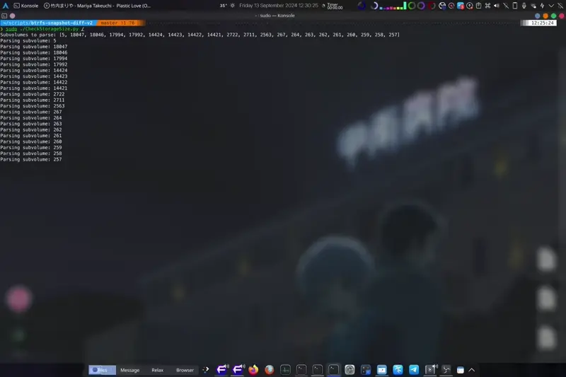
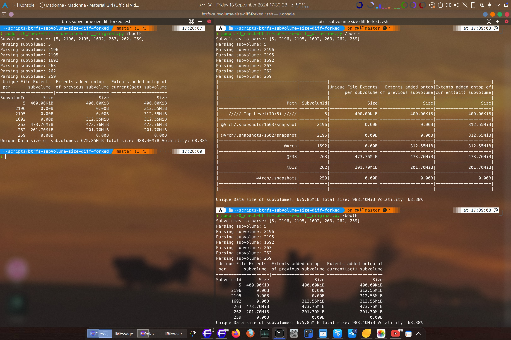
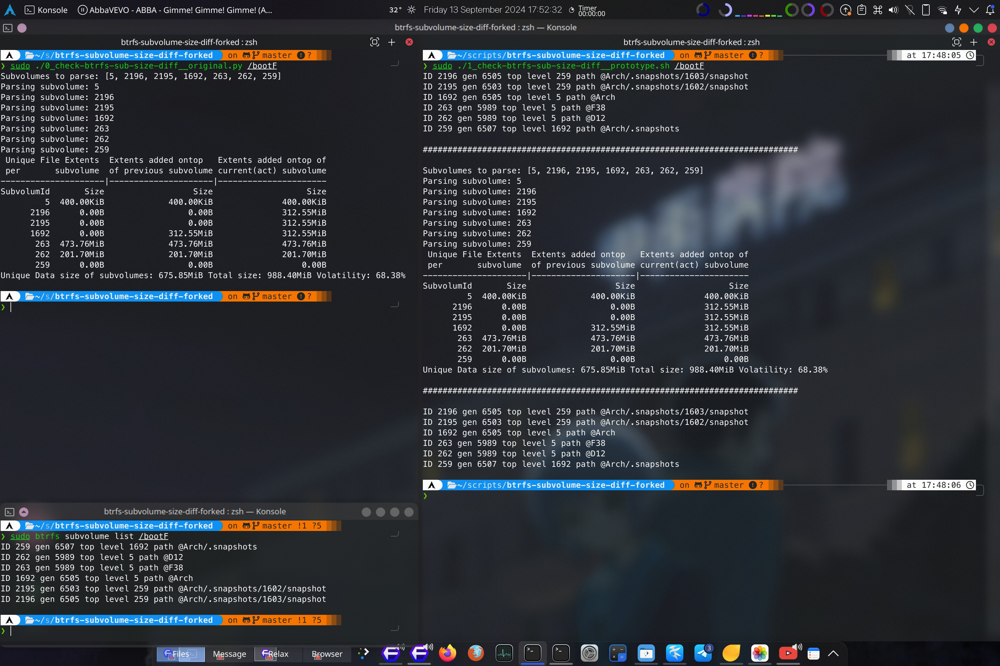
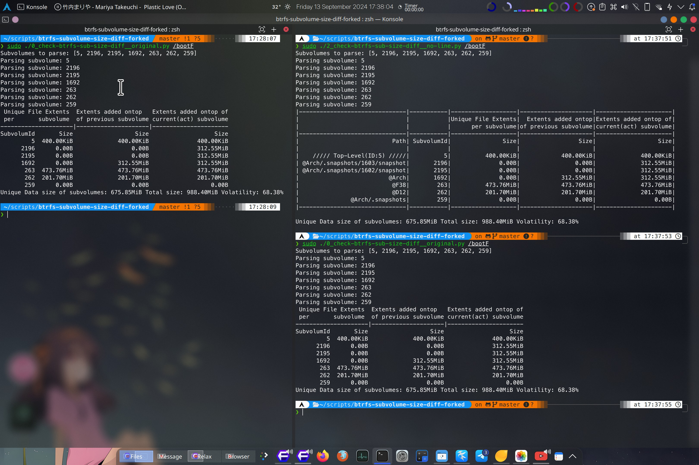

# btrfs-subvolume-size-diff-forked

依個項目係 [`dim-geo`](https://github.com/dim-geo/)開發嘅工具 [`btrfs-snapshot-diff`](https://github.com/dim-geo/btrfs-snapshot-diff/) 嘅一個fork。佢可以比較 btrfs snapshot 之間嘅差異，唔需要啟用 btrfs 嘅quota功能！

依個fork主要改進咗可以顯示 subvolume 嘅路徑同佢哋嘅 ID。咁樣可以更加容易分析同管理 Btrfs subvolumes，特別係處理複雜嘅snapshot結構時。

[**!! For English README, Please Click here!!** This is the Cantonese(Hong Kong) version](README_ENG.md)

<details>
  <summary>影片</summary>
            
https://github.com/user-attachments/assets/3c45d540-4ad1-4976-924c-41aefade0534
</details>



## 概覽

- [1. 點解你會需要依個工具？](#1-點解你會需要依個工具)
- [2. 原版本嘅功能](#2-原版本嘅功能)
- [3. 相比原版本嘅改進](#3-相比原版本嘅改進)
- [4. 點樣運作](#4-點樣運作)
- [5. 如何安裝](#5-如何安裝)
- [6. 使用方式](#6-使用方式)
            - [6.1 範例](#61-範例)
- [7. 版本](#7-版本)
- [8. 授權](#8-授權)
- [9. 貢獻](#9-貢獻)
            - [9.1 可能嘅擴展](#91-可能嘅擴展)

## 1. 點解你會需要依個工具？

Btrfs 係一個 CoW (Copy on Write)檔案系統，對於分析snapshot(/subvolume)嘅大小同snapshot之間嘅差異有問題。

通過使用 [python-btrfs](https://github.com/knorrie/python-btrfs)，可以解析 btrfs 檔案系統嘅中繼數據，同時搵出 subvolumes/snapshots 之間嘅差異。

## 2. 原版本嘅功能：

依個工具可以大概分析當一個 snapshot(/subvolume) 被刪除時，會釋放幾多空間。

## 3. 相比 [原版本](https://github.com/dim-geo/btrfs-snapshot-diff/) 嘅改進

- **Subvolume 路徑集成**: 依個fork嘅主要改進係輸出包括 subvolume 路徑，令資訊更加易讀，對於管理多個snapshot嘅用戶更加有用。
- **行間分隔**: 增加行間距，提高可讀性同維護性。

  >>>  

## 4. 點樣運作：

依個工具分析 btrfs 檔案系統中嘅所有 subvolumes。對於每個 subvolume，解析並保存所有唔係 inline 嘅檔案範圍。所有其他項目會被忽略。

之後，我哋建立一個snapshot延伸或範圍內使用嘅樹狀架構：

1. 檔案延伸 1
   1. 範圍 1: [Snapshot 1, Snapshot 2]
   2. 範圍 2: [Snapshot 3]
   3. ...
2. 檔案延伸 2
   1. 範圍 1: [...]
   2. 範圍 2: [...]

咁樣，就可以從每個檔案範圍中提取 Snapshot 1 嘅實際磁碟大小。

---

## 5. 如何安裝

### 進階用戶 (Hey! 我嘅 python 已經設置好)
#### 前置條件
- BTRFS 分區有 subvolumes(/snapshots)
- 需要安裝 [python-btrfs](https://github.com/knorrie/python-btrfs)。
- 直接跳到 [使用方式](#6-使用方式)
----
### 下載依個項目
將依個倉庫下載到你嘅喜愛位置。我放喺 `$Home/scripts`

1. 喺 $USER 資料夾下創建一個資料夾
> `cd $HOME && mkdir scripts`

2. 克隆依個 repo 到 `$Home/scripts`
> `git clone https://github.com/Ramen-LadyHKG/btrfs-subvolume-size-diff-forked.git`

### 確保 python 配置好

3. 設置 python
呢度我無法提供詳細嘅 python 設置因為唔同發行版之間有差異。
我建議你搵啲更好嘅資源。
> https://docs.python-guide.org/starting/install3/linux/
> https://docs.aws.amazon.com/zh_tw/elasticbeanstalk/latest/dg/eb-cli3-install-linux.html

4. 我建議使用虛擬環境來設置 python
> 例如\
>> `mkdir $HOME/.python`\
>> `python -m venv $HOME/.python`\
>> `source $HOME/.python/bin/activate`\
>> `python -m pip install --upgrade pip`

5. 安裝 `btrfs` python library
>> `python -m pip install btrfs`

**可選。** 將 `cbsd` (check-btrfs-size-diff) 別名添加到你嘅 Shell 環境檔案。
>> `echo -e "\nalias cbsd='sudo $HOME/scripts/btrfs-subvolume-size-diff-forked/3_check-btrfs-sub-size-diff__with-line.py'" >>  $HOME/.zshrc`

完成

## 6. 使用方式

程序係單線程，可能會用好多內存，對磁碟有較大嘅讀取壓力。可能需要幾分鐘時間。使用 ionice 同監控佢嘅內存使用情況。內存使用同執行時間取決於數據集。程序唔進行任何寫入操作。執行期間唔好修改 subvolume/snapshot。避免寫數據到任何 subvolume 或平行執行 dedup 程序。

1. 將 shell 轉到依個 repo 嘅資料夾
>> `cd $HOME/btrfs-subvolume-size-diff-forked`

2. 運行腳本時有或無選項
>> `3_check-btrfs-sub-size-diff__with-line.py [-u] [-f] [-r <root tree, default 5>] /path/to/btrfs/ [ -i | -o ] [<subvolume id1> <subvolume id2>]`

       **可選**
       如果你已經完成咗別名設置
>> `cbsd /path/to/btrfs/mount/`

`-u` 計算每個 snapshot 所佔用嘅唯一數據。因此，`-r` 就無意義。指定要忽略嘅 subvolumes 可能會影響 `-u` 嘅結果，因為指定嘅 subvolume 數據唔會被解析！\
`-f` 尋找可能貢獻到唯一範圍嘅檔案。\
`-i` 令程序忽略指定嘅 subvolumes，依個係默認行為，如果唔指定 `-i` 或 `-o` 參數但有提供 subvolumes 嘅情況下。\
`-o` 令程序只分析指定嘅 subvolumes。

你可以通過以下命令找到 subvolume ID：
`btrfs subvolume list /path/to/btrfs`

### 6.1. 範例：

`sudo btrfs subvolume list  --sort=-rootid /`:
```
ID 18085 gen 526073 top level 267 path @home/.snapshots/2/snapshot
ID 18084 gen 526071 top level 263 path @snapshots/1827/snapshot
ID 18083 gen 526069 top level 263 path @snapshots/1826/snapshot
ID 18082 gen 526069 top level 267 path @home/.snapshots/1/snapshot
ID 18065 gen 525568 top level 263 path @snapshots/1825/snapshot
ID 17994 gen 523504 top level 263 path @snapshots/1803/snapshot
ID 17992 gen 523427 top level 263 path @snapshots/1801/snapshot
ID 14424 gen 513650 top level 14421 path flatpak-installs
ID 14423 gen 525575 top level 14421 path var/tmp
ID 14422 gen 514035 top level 14421 path usr/share/waydroid-extra
ID 14421 gen 526112 top level 5 path @
ID 2722 gen 523512 top level 5 path @opt
ID 2711 gen 526112 top level 257 path @home/curie/.cache
ID 2563 gen 513947 top level 5 path @var_lib_libvirt_images
ID 267 gen 526073 top level 257 path @home/.snapshots
ID 264 gen 513650 top level 5 path @swap
ID 263 gen 526072 top level 5 path @snapshots
ID 262 gen 513650 top level 5 path @var_tmp
ID 261 gen 526112 top level 5 path @var_log
ID 260 gen 526094 top level 5 path @var_cache
ID 259 gen 513650 top level 5 path @srv
ID 258 gen 525924 top level 5 path @rootf
ID 257 gen 526112 top level 5 path @home

```

### 使用範例

選擇 `14421` 作為(使用中)嘅 root partition(/subvolume/snapshot) 去比較

選項 `-r` 嘅作用同使用方式喺help有說明
> `  -r ROOT, --root ROOT  current active subvolume to analyze first, default is 5`
```bash
$ `sudo ./check-btrfs-sub-size-diff_3__with-line.py -r 14421/`

Subvolumes to parse: [14421, 18085, 18084, 18083, 18082, 18065, 17994, 17992, 14424, 14423, 14422, 2722, 2711, 2563, 267, 264, 263, 262, 261, 260, 259, 258, 257, 5]
Parsing subvolume: 14421
Parsing subvolume: 18085
Parsing subvolume: 18084
Parsing subvolume: 18083
Parsing subvolume: 18082
Parsing subvolume: 18065
Parsing subvolume: 17994
Parsing subvolume: 17992
Parsing subvolume: 14424
Parsing subvolume: 14423
Parsing subvolume: 14422
Parsing subvolume: 2722
Parsing subvolume: 2711
Parsing subvolume: 2563
Parsing subvolume: 267
Parsing subvolume: 264
Parsing subvolume: 263
Parsing subvolume: 262
Parsing subvolume: 261
Parsing subvolume: 260
Parsing subvolume: 259
Parsing subvolume: 258
Parsing subvolume: 257
Parsing subvolume: 5
|-------------------------------|-----------|-------------------|---------------------|----------------------|
|                               |           |Unique File Extents|  Extents added ontop|Extents added ontop of|
|                               |           |      per subvolume|of previous subvolume|current(act) subvolume|
|-------------------------------|-----------|-------------------|---------------------|----------------------|
|                           Path| SubvolumId|               Size|                 Size|                  Size|
|-------------------------------|-----------|-------------------|---------------------|----------------------|
|                              @|      14421|           68.00KiB|             24.34GiB|              24.37GiB|
|-------------------------------|-----------|-------------------|---------------------|----------------------|
|    @home/.snapshots/2/snapshot|      18085|          116.00KiB|             32.49GiB|              32.49GiB|
|-------------------------------|-----------|-------------------|---------------------|----------------------|
|       @snapshots/1827/snapshot|      18084|              0.00B|                0.00B|              68.00KiB|
|-------------------------------|-----------|-------------------|---------------------|----------------------|
|       @snapshots/1826/snapshot|      18083|              0.00B|             24.34GiB|              68.00KiB|
|-------------------------------|-----------|-------------------|---------------------|----------------------|
|    @home/.snapshots/1/snapshot|      18082|          216.00KiB|             32.49GiB|              32.49GiB|
|-------------------------------|-----------|-------------------|---------------------|----------------------|
|       @snapshots/1825/snapshot|      18065|            2.75MiB|            144.95MiB|               2.79MiB|
|-------------------------------|-----------|-------------------|---------------------|----------------------|
|       @snapshots/1803/snapshot|      17994|            3.04MiB|             45.61MiB|              58.10MiB|
|-------------------------------|-----------|-------------------|---------------------|----------------------|
|       @snapshots/1801/snapshot|      17992|           43.60MiB|             24.28GiB|              98.66MiB|
|-------------------------------|-----------|-------------------|---------------------|----------------------|
|               flatpak-installs|      14424|            8.00KiB|              8.00KiB|               8.00KiB|
|-------------------------------|-----------|-------------------|---------------------|----------------------|
|                        var/tmp|      14423|              0.00B|                0.00B|                 0.00B|
|-------------------------------|-----------|-------------------|---------------------|----------------------|
|       usr/share/waydroid-extra|      14422|            2.29GiB|              2.29GiB|               2.29GiB|
|-------------------------------|-----------|-------------------|---------------------|----------------------|
|                           @opt|       2722|           10.65GiB|             10.65GiB|              10.65GiB|
|-------------------------------|-----------|-------------------|---------------------|----------------------|
|             @home/curie/.cache|       2711|           11.14GiB|             11.14GiB|              11.14GiB|
|-------------------------------|-----------|-------------------|---------------------|----------------------|
|        @var_lib_libvirt_images|       2563|          691.54MiB|            691.54MiB|             691.54MiB|
|-------------------------------|-----------|-------------------|---------------------|----------------------|
|               @home/.snapshots|        267|              0.00B|                0.00B|                 0.00B|
|-------------------------------|-----------|-------------------|---------------------|----------------------|
|                          @swap|        264|            8.00GiB|              8.00GiB|               8.00GiB|
|-------------------------------|-----------|-------------------|---------------------|----------------------|
|                     @snapshots|        263|           48.00KiB|             48.00KiB|              48.00KiB|
|-------------------------------|-----------|-------------------|---------------------|----------------------|
|                       @var_tmp|        262|              0.00B|                0.00B|                 0.00B|
|-------------------------------|-----------|-------------------|---------------------|----------------------|
|                       @var_log|        261|            4.25GiB|              4.25GiB|               4.25GiB|
|-------------------------------|-----------|-------------------|---------------------|----------------------|
|                     @var_cache|        260|           52.64MiB|             52.64MiB|              52.64MiB|
|-------------------------------|-----------|-------------------|---------------------|----------------------|
|                           @srv|        259|              0.00B|                0.00B|                 0.00B|
|-------------------------------|-----------|-------------------|---------------------|----------------------|
|                         @rootf|        258|          192.73MiB|            192.73MiB|             192.73MiB|
|-------------------------------|-----------|-------------------|---------------------|----------------------|
|                          @home|        257|           14.77MiB|             32.52GiB|              32.50GiB|
|-------------------------------|-----------|-------------------|---------------------|----------------------|
|    ///// Top-Level(ID:5) /////|          5|              0.00B|                0.00B|                 0.00B|
|-------------------------------|-----------|-------------------|---------------------|----------------------|
|-------------------------------|-----------|-------------------|---------------------|----------------------|

Unique Data size of subvolumes: 37.31GiB Total size: 94.22GiB Volatility: 39.60%
```

#### Explain
Snapshot `1801` 増加咗 `24.28GiB`, 然而大部份嘅佔用仲保留喺檔案系統入面 (可能佔用係嚟自新嘅 snapshot, `1803`)
因此刪除 snapshot `1801`，只會釋放出 `43.6MiB`嘅空間。 Snapshot `1801` 有 `98.66MiB` 嘅改變(不能共用嘅檔案資源)對比目前/使用中嘅 (`14421`) subvolume.

當使用 `-u` 引數時時，只有第一列會有數值。

## 7. 版本

1. **0_check-btrfs-sub-size-diff__original.py** - 原始版本。
2. **1_check-btrfs-sub-size-diff__prototype.sh** - 原型版本。
3. **2_check-btrfs-sub-size-diff__no-line.py** - 無行間距版本。
4. **3_check-btrfs-sub-size-diff__with-line.py** - 有行間距版本。

### 歷史 / 差異
**版本 1**
  >  唔多改動，單純克隆咗原版本，並加咗一個 bash 腳本喺 python 腳本之前同之後執行 `sudo btrfs subvolume list $1`。\
  >> -需要 [原版本 python 腳本](0_check-btrfs-sub-size-diff__original.py) 才能夠運作。\
  >> -唔能夠使用 [原版本 python 腳本](0_check-btrfs-sub-size-diff__original.py) 嘅進階功能。
  >>> `./1_check-btrfs-sub-size-diff__prototype.sh /path/to/btrfs/mount/` 係唯一使用方法。\
  > \
> 

**版本 2**
  >  完全實現咗 `sudo btrfs subvolume list $1` 嘅輸出到 python 腳本入面。佢會顯示 subvolume 嘅路徑同 subvolume ID。\
  >> + [原始 python 腳本](0_check-btrfs-sub-size-diff__original.py) 嘅所有功能都完好保留。
   >>> 

**版本 3**
  >  改進咗輸出格式，提升可讀性，用行距保持列嘅對齊一致。\
  >> + [原始 python 腳本](0_check-btrfs-sub-size-diff__original.py) 嘅所有功能都完好保留。
  >>>  

## 8. 授權

依個項目係根據 GNU 通用公共許可證（GPL）第 3 版，2007 年 6 月 29 日發佈。詳細內容見 [LICENSE](LICENSE) 檔案。

## 9. 貢獻

如果你遇到任何漏洞或有進一步改進嘅建議，歡迎提出問題或提交 pull requests！

### 9.1 可能嘅擴展：

計算中繼數據區塊嘅差異大小。
考慮到 inline 檔案區間。
點解我哋會多次收到相同範圍嘅相同區段？

由於只係有細微改動，呢個 fork 項目可能會合併返入 [原始項目](https://github.com/dim-geo/btrfs-snapshot-diff/)。
